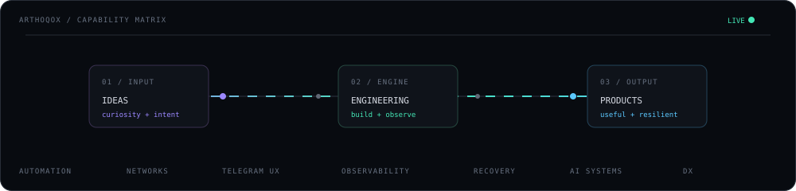
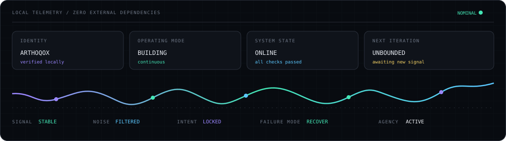

<div align="center">



<br>

<a href="https://github.com/Arthoqox?tab=followers"></a>
<a href="https://github.com/Arthoqox?tab=repositories"></a>


</div>

```console
arthoqox@agency:~$ ./identity --verbose
[ ok ] USER        Arthoqox / Андрей
[ ok ] ROLE        developer · digital builder · systems thinker
[ ok ] MODE        building
[ ok ] ENERGY      curiosity → experiment → production
[ ok ] INTERESTS   automation / infrastructure / product engineering / AI
[ ok ] RULE        if it can be simpler, faster or smarter — rebuild it
```

> I take ideas that initially look too ambitious and turn them into real, usable systems. I care equally about what happens under the hood and how the final experience feels in the hands of a person.



## `01 // operating_profile`

<table>
<tr>
<td width="50%" valign="top">

#### `~/what-i-build`

```yaml
ideas:
  state: always_processing
approach:
  sequence: [explore, build, break, improve]
quality:
  priority: clarity_over_noise
systems:
  character: resilient_by_design
direction:
  constraint: none
```

</td>
<td width="50%" valign="top">

#### `~/how-i-think`

```diff
+ hide complexity inside the system
+ treat interface quality as engineering
+ build observability before emergencies
+ design recovery as a product feature
+ ship, measure, refine, repeat
- generic solutions without character
- complexity passed to the user
```

</td>
</tr>
</table>

## `02 // loaded_modules`

<div align="center">


</div>

```text
runtime        TypeScript / Node.js / Python
data           PostgreSQL / Redis
operations     Docker / Linux / Git
interfaces     human-first tools / APIs / control surfaces
direction      reliable systems with calm, precise UX
```

## `03 // public_telemetry`

<div align="center">



</div>

## `04 // signal_daemon`

<div align="center">
  
</div>

```console
arthoqox@agency:~$ connection --status
channel     github.com/Arthoqox
access      public
state       open_to_interesting_ideas
message     "strange technical challenge? something worth building? send signal."
```

<div align="center">

<a href="https://github.com/Arthoqox"></a>
<a href="https://github.com/Arthoqox?tab=repositories"></a>

<br><br>

<sub><code>ARTHOQOX // BUILT WITH INTENT // NO GENERIC MODE</code></sub>

</div>
