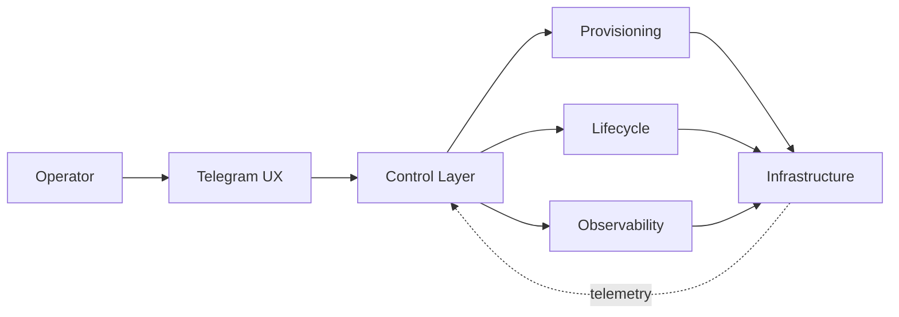

<div align="center">


<br>

<a href="https://github.com/Arthoqox?tab=followers"></a>
<a href="https://github.com/Arthoqox?tab=repositories"></a>


</div>

```console
arthoqox@hackbook:~$ ./identity --verbose
[ ok ] USER        Arthoqox / Андрей
[ ok ] ROLE        developer · digital builder · systems thinker
[ ok ] MODE        building
[ ok ] ENERGY      curiosity → experiment → production
[ ok ] INTERESTS   automation / infrastructure / product engineering / AI
[ ok ] RULE        if it can be simpler, faster or smarter — rebuild it
```

> I take ideas that initially look too ambitious and turn them into real, usable systems. I care equally about what happens under the hood and how the final experience feels in the hands of a person.


## `01 // operating_profile`

<table>
<tr>
<td width="50%" valign="top">

#### `~/what-i-build`

```yaml
automation:
  goal: remove repetitive work
infrastructure:
  interface: clear control surfaces
products:
  channels: [telegram, web, api]
experiments:
  intersection: networks × design × ai
reliability:
  assumption: reality_will_get_messy
```

</td>
<td width="50%" valign="top">

#### `~/how-i-think`

```diff
+ hide complexity inside the system
+ treat interface quality as engineering
+ build observability before emergencies
+ design recovery as a product feature
+ ship, measure, refine, repeat
- generic solutions without character
- complexity passed to the user
```

</td>
</tr>
</table>

## `02 // current_process`

```text
 PID   PROCESS       STATE      CPU   MEMORY    DESCRIPTION
 001   HiDDENODE     BUILDING   72%   ACTIVE    private-access infrastructure tooling
 002   automation    RUNNING    48%   STABLE    provisioning · lifecycle · recovery
 003   telegram-ux   TUNING     31%   ACTIVE    fast control flows for complex systems
 004   ai-systems    RESEARCH   18%   WARM      useful assistance with human control
```

<details>
<summary><b>process/001 → HiDDENODE</b></summary>
<br>

My current large-scale build: automation and control tooling for private-access infrastructure. It is one active project in the wider Arthoqox system — not the identity of this profile.



</details>

## `03 // loaded_modules`

<div align="center">


</div>

```text
runtime        TypeScript / Node.js / Python
data           PostgreSQL / Redis
operations     Docker / Linux / Git
interfaces     Telegram bots / APIs / control panels
direction      reliable systems with calm, precise UX
```

## `04 // public_telemetry`

<div align="center">

<picture>
  <source media="(prefers-color-scheme: dark)" srcset="https://github-readme-stats.vercel.app/api?username=Arthoqox&show_icons=true&hide_border=true&include_all_commits=true&rank_icon=github&bg_color=080b10&title_color=43e6b5&text_color=a7b0be&icon_color=9b87ff">
  <source media="(prefers-color-scheme: light)" srcset="https://github-readme-stats.vercel.app/api?username=Arthoqox&show_icons=true&hide_border=true&include_all_commits=true&rank_icon=github&bg_color=f8fafc&title_color=047857&text_color=334155&icon_color=6d5dfc">
  
</picture>
<picture>
  <source media="(prefers-color-scheme: dark)" srcset="https://streak-stats.demolab.com?user=Arthoqox&hide_border=true&background=080B10&ring=43E6B5&fire=9B87FF&currStreakLabel=43E6B5&sideLabels=A7B0BE&dates=697281&sideNums=F4F7FB&currStreakNum=F4F7FB">
  <source media="(prefers-color-scheme: light)" srcset="https://streak-stats.demolab.com?user=Arthoqox&hide_border=true&background=F8FAFC&ring=047857&fire=6D5DFC&currStreakLabel=047857&sideLabels=334155&dates=64748B&sideNums=0F172A&currStreakNum=0F172A">
  
</picture>

<br>

<picture>
  <source media="(prefers-color-scheme: dark)" srcset="https://github-readme-activity-graph.vercel.app/graph?username=Arthoqox&bg_color=080b10&color=a7b0be&line=43e6b5&point=9b87ff&area=true&area_color=12352f&hide_border=true&custom_title=ARTHOQOX%20%2F%2F%20EVENT%20STREAM">
  <source media="(prefers-color-scheme: light)" srcset="https://github-readme-activity-graph.vercel.app/graph?username=Arthoqox&bg_color=f8fafc&color=334155&line=047857&point=6d5dfc&area=true&area_color=d1fae5&hide_border=true&custom_title=ARTHOQOX%20%2F%2F%20EVENT%20STREAM">
  
</picture>

</div>

## `05 // contribution_daemon`

<div align="center">
  <picture>
    <source media="(prefers-color-scheme: dark)" srcset="https://raw.githubusercontent.com/Arthoqox/Arthoqox/output/github-contribution-grid-snake-dark.svg">
    <source media="(prefers-color-scheme: light)" srcset="https://raw.githubusercontent.com/Arthoqox/Arthoqox/output/github-contribution-grid-snake.svg">
    
  </picture>
</div>

```console
arthoqox@hackbook:~$ connection --status
channel     github.com/Arthoqox
access      public
state       open_to_interesting_ideas
message     "strange technical challenge? something worth building? send signal."
```

<div align="center">

<a href="https://github.com/Arthoqox"></a>
<a href="https://github.com/Arthoqox?tab=repositories"></a>

<br><br>

<sub><code>ARTHOQOX // BUILT WITH INTENT // NO GENERIC MODE</code></sub>

</div>
